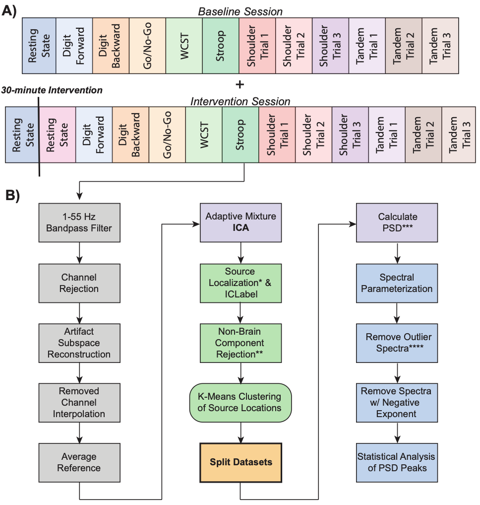
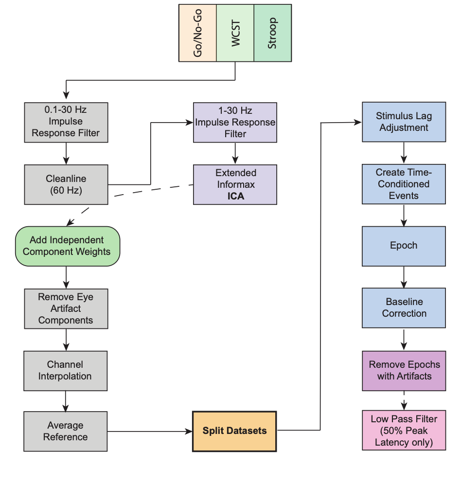
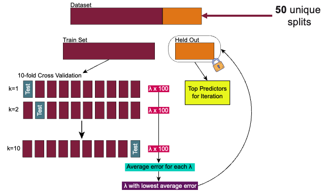

# Exergaming ADHD Research: Analytical Code Repository

This repository contains the complete analytical pipeline for a dissertation investigating psychological, behavioral, and neural outcomes in young adults with ADHD following exergaming interventions.

**Dissertation Citation:**
Tasnim, N.E. (2026). Identifying the psychological, behavioral, and neural effects of dance on young adults with ADHD [Doctoral disseration, Virginia Tech].

## Study Overview

**Design**: 3-arm randomized controlled trial (RCT)  
**Sample**: N=67 young adults with ADHD (63 completed intervention; n=21 per group)  
**Interventions**:
- Dance exergaming (Just Dance 2024)
- Stationary biking while viewing the game
- Music listening/watching (sedentary control)

**Sessions**: 2 sessions per participant (~1 week apart), with baseline assessment and 30-minute intervention followed by 30-minute cooldown before post-measures

**Measures**:
- Electrophysiology: EEG, event-related potentials (ERPs)
- Physical: Balance (force plate), heart rate
- Behavioral: Borg Rating of Perceived Exertion (RPE)
- Psychological: ADHD symptom questionnaires, mental health scales, executive function tasks

**Tasks**: Go/No-Go, Stroop, Wisconsin Card Sorting Test (WCST), Digit Span (forward/backward), resting state EEG (counterbalanced order)

**Clinical Trial Registration**: [NCT07318935](https://clinicaltrials.gov/study/NCT07318935?id=NCT07318935&rank=1)

---

## Publications

This repository supports two papers in preparation for submission to peer-reviewed journals:

### Paper 1: Cross-Sectional Prediction of ADHD Symptom Severity
**Focus**: Machine learning prediction of ADHD symptom severity using baseline neurophysiological and behavioral data  
**Methods**: LASSO regression, XGBoost classification, spectral parameterization, functional connectivity  
**Code location**: `paper1/`

**Citation**: Tasnim, N., Makani, H., Basso, J.C. (2026). Psychological, behavioral, and neural predictors of attention-deficit/hyperactivity disorder symptomotology in young adults.

### Paper 2: Acute Effects of Exergaming Intervention (RCT)
**Focus**: Randomized controlled trial examining acute cognitive and neural effects of different exergaming modalities  
**Methods**: Linear mixed-effects models, spectral parameterization, functional connectivity, physiological monitoring  
**Code location**: `paper2/`

**Citation**: Tasnim, N., Zarnegar, Z., Basso, J.C. (2026). Acute bouts of dance and exercise suppress alpha activity and enhance cognitive flexibility in young adults with attention-deficit/hyperactivity disorder. 

---

## Repository Structure

```
├── paper1/                      # Paper 1: Cross-sectional prediction
│   ├── specparam/              # Spectral parameterization (ASRS grouping)
│   ├── statistical_modeling/   # LASSO, XGBoost prediction models
│   ├── connectivity/           # Functional connectivity + ML analysis
│   ├── demographics/           # Baseline correlations, ASRS analysis
│   └── force/                  # Balance modeling (ASRS as predictor)
│
├── paper2/                      # Paper 2: Intervention RCT
│   ├── eeg_preprocessing/      # Intervention-specific EEG pipeline
│   ├── specparam/              # Spectral parameterization (intervention groups)
│   ├── specparam_modeling/     # Mixed-effects models for spectral changes
│   ├── connectivity/           # Functional connectivity modeling
│   ├── demographics/           # Demographics, mental health, ERP outcomes
│   ├── force/                  # Balance mixed-effects modeling
│   ├── heart_rate/             # HR and Borg RPE during intervention
│   ├── screening/              # CONSORT flow diagram
│   └── docs/                   # Intervention-specific metadata
│
├── shared/                      # Shared preprocessing infrastructure
│   ├── Time_Series_MATLAB_Scripts/  # EEG preprocessing, IC clustering
│   ├── ERP_scripts/            # Event-related potential pipeline
│   ├── MATLAB_functions/       # Shared MATLAB utilities
│   ├── specparam_utils/        # Spectral parameterization helpers
│   ├── force_preprocessing/    # COP calculation and tidying
│   ├── demographics_preprocessing/  # REDCap data cleaning
│   ├── file_organizing/        # Raw data organization
│   └── docs/                   # Metadata files (ROI labels, channel info)
```

---

## Technologies & Dependencies

### MATLAB
- **EEG/ERP Processing**: EEGLAB, ERPLAB, AMICA, ICLabel, clean_rawdata, dipfit, ROIconnect
- **Version**: MATLAB R2020a or later recommended
- **Toolboxes**: Signal Processing Toolbox, Statistics and Machine Learning Toolbox

### Python
- **Spectral Analysis**: `specparam` (formerly known as FOOOF)
- **Neuroimaging**: `nilearn`
- **Data Processing**: `numpy`, `pandas`, `scipy`, `h5py`
- **Version**: Python 3.7+

### R
- **Statistical Modeling**: `lme4`, `lmerTest`, `glmnet`, `xgboost`
- **Data Manipulation**: `tidyverse` suite
- **Visualization**: `ggplot2`
- **Version**: R 4.0+

**Note**: This repository does not include formal dependency management files (no `requirements.txt` or `renv.lock`). Dependencies should be inferred from script imports.

---

## Data Processing Pipelines

### EEG Time-Series Pipeline
**MATLAB → Python → R**

1. **Preprocessing** (`shared/Time_Series_MATLAB_Scripts/exergamePreprocess.m`)
   - Bandpass filter: 1-55 Hz (Hamming FIR)
   - Artifact rejection: clean_rawdata, ASR
   - ICA decomposition: AMICA (2000 iterations)
   - Source localization: DIPFIT (MNI template)
   - Component selection: ICLabel (>50% brain, RV <15%)



2. **Clustering** (k-means, 7-21 clusters tested, 11 identified)

3. **Power Spectral Density** (`SpecParamPrep.m`)
   - Welch's method (nfft=500, overlap=250, window=500)

4. **Spectral Parameterization** (`shared/specparam_utils/findBestModel.py`)
   - Fits aperiodic (1/f) and periodic (oscillatory) components
   - Parameters: peak width limits: 2-8 Hz; minimum peak height: 0.2 dB; peak threshold: 2 SD; maximum number of peaks: 6; aperiodic mode: fixed
   - Frequency bands: theta (4-8 Hz), alpha (8-12 Hz), low beta (12-20 Hz), high beta (20-30 Hz), gamma (30-45 Hz)

5. **Statistical Modeling** (R scripts in `paper1/` or `paper2/`)

### ERP Pipeline
**MATLAB → R**

1. **Preprocessing** (`shared/ERP_scripts/ERP_processing.m`)
   - Bandpass: 0.1-30 Hz (Butterworth)
   - Line noise removal: Cleanline (60 Hz)
   - ICA: Extended Infomax on 1-30 Hz copy
   - Artifact rejection: Voltage thresholds, moving window



2. **Component Measurement**
   - All measured on difference waves
   - Mean amplitude, 50% area latency, 50% peak latency
   - **Go/No-Go**: P3b (Pz, Cz), N2 (Fz)
   - **Stroop**: N2 (Fz), P3b (Pz)
   - **WCST**: ERN (Fz), FRN (Fz)

### Functional Connectivity Pipeline
**MATLAB → R**

1. **Source Reconstruction** (`paper1/connectivity/run_roiConnect.m`)
   - Colin27_5003 source model
   - Desikan-Killiany atlas (68 ROIs)
   - LCMV beamformer
   - PCA (3 components per ROI)

2. **Connectivity Metric**: Multivariate Interaction Measure (MIM)

3. **Network Analysis**: DMN (14 ROIs) and DAN (12 ROIs) subnetwork extraction

### Force Plate Pipeline
**Python → R**

1. **Processing** (`shared/force_preprocessing/run_COP_functions.py`)
   - 4th-order Butterworth filter (5 Hz)
   - Metrics: RMS distance, mean velocity

2. **Statistical Modeling** (`shared/force_preprocessing/03_modeling_COP.R`)

### Generalized Linear Model with LASSO Regularization Pipeline
This model was created for Paper 1 to identify top predictors of ADHD symptom severity while optimizing the regularization parameter (lambda)



---

## Data Exclusions

The following participants were excluded from all analyses:
- **EXGM007, EXGM024**: Excluded entirely
- **EXGM152, EXGM175**: Dropouts
- **EXGM077, EXGM160**: Significant session time lapse

**Balance analyses** additionally exclude 8 participants:
- 7 with lower extremity injury or chronic pain
- 1 statistical outlier

---

## Quality Control Thresholds

### Spectral Parameterization
- **Paper 1**: Error >0.103, R² <0.559, negative exponents removed
  - Final: 5831 spectra, 11 clusters (>75% participant coverage for modeling)
- **Paper 2**: Error >0.103, R² <0.575
  - Final: 11394 spectra, 10 clusters (≥50% per treatment arm for hypothesis testing)

### ERP Artifact Rejection
- **Fp1/Fp2 step function**: 50 μV (blinks), 32 μV (HEOG)
- **Absolute threshold**: 100 μV
- **Moving window**: Peak-to-peak 100 μV

---

## Contact

**Lead Author**: Dr. Noor Tasnim
**Email**: [ntasnim@vt.edu]  
**Institution**: Virginia Tech

**Primary Investigator**: Dr. Julia C. Basso  
**Email**: [jbasso@vt.edu]  
**Institution**: Virginia Tech

For questions about about the Methods, please contact the lead author and PI. For data access, please contact the PI directly.

---

## File Organization Notes

- **Shared vs. Paper-Specific**: Files that differ between papers (e.g., different thresholds, grouping variables) have separate copies in `paper1/` and `paper2/`. Truly shared preprocessing lives in `shared/`.
- **Cross-Language Data Exchange**: 
  - MATLAB → Python: `.mat` files (v7.3/HDF5)
  - MATLAB → R: `.csv` exports
  - Python → R: `.csv` files
  - R → R: `.rds` for objects, `.csv` for tables

